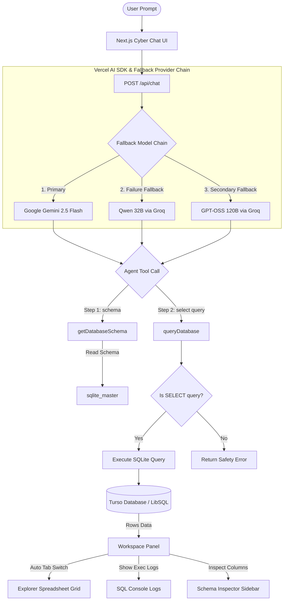
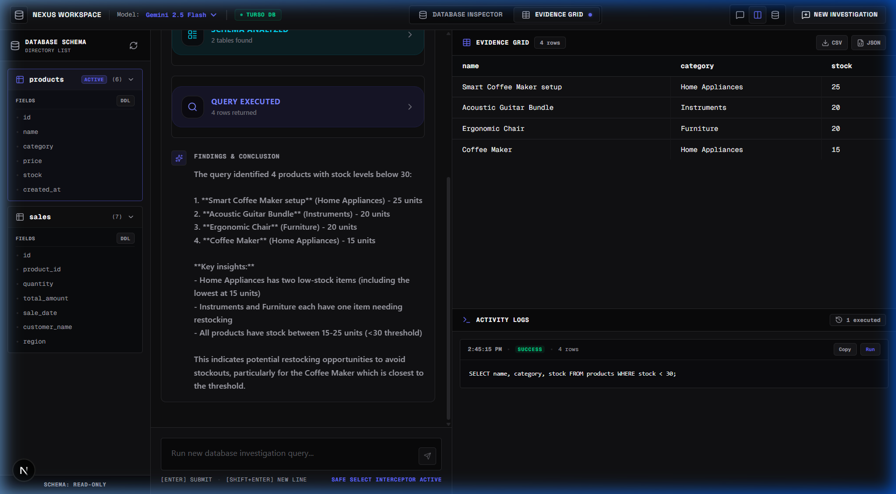
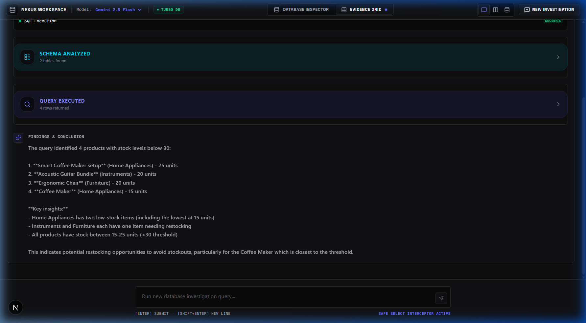
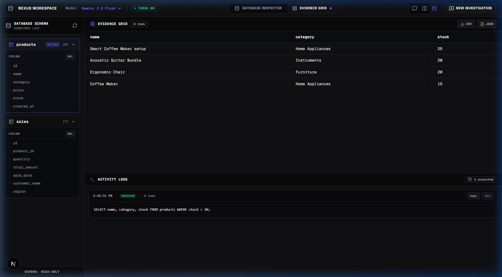
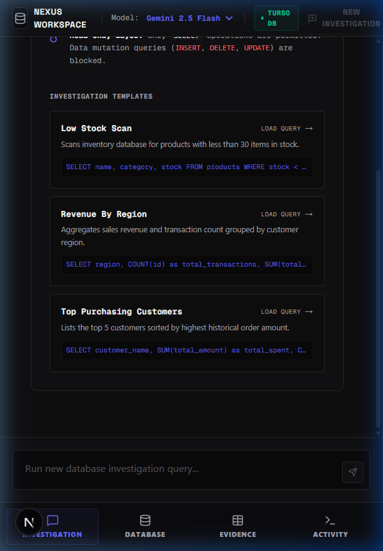
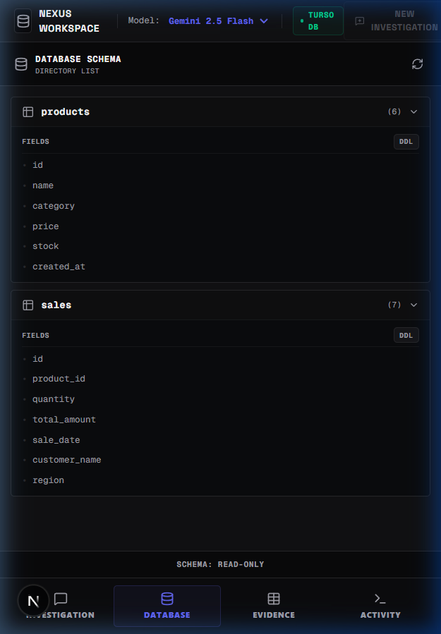
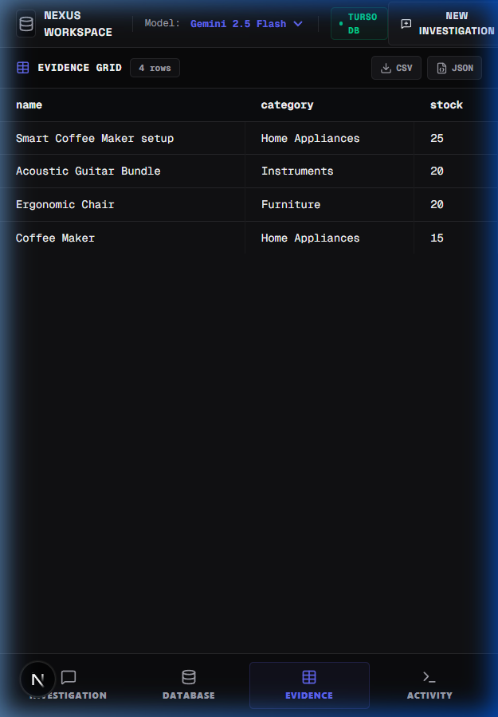
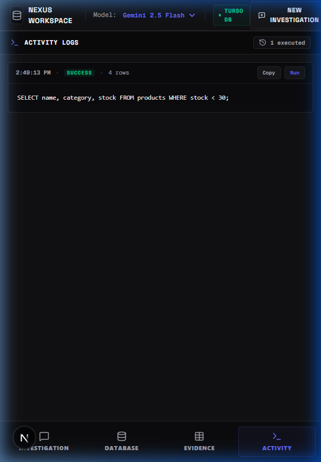

# 🌌 Nexus DB Agent

[](https://nextjs.org/)
[](https://www.typescriptlang.org/)
[](https://turso.tech/)
[](https://sdk.vercel.ai/)
[](https://deepmind.google/technologies/gemini/)

> An intelligent, responsive Cyber Obsidian SQL assistant that translates natural language into secure SQLite queries, executes them against a Turso database, and visualizes results instantly.

---

## 📖 Project Overview

### The Problem
Querying relational databases typically requires deep SQL knowledge, creating friction for developers, product managers, and business stakeholders who need quick answers. Building static dashboards is time-consuming, and granting direct database access poses severe security risks.

### The Solution
**Nexus DB Agent** bridges the gap. It enables users to query their database using plain English. The agent handles the schema scanning, formulates valid SQL queries, runs the query safely, and visualizes the results on a beautiful spreadsheet-like grid—all within a secure, read-only layer.

### Key Value Proposition
- **Natural Interface:** No SQL writing or schema memorization needed.
- **Dynamic Context mapping:** Scans table columns in real time.
- **Fail-Safe Robustness:** Automatically falls back through multiple LLM providers (Gemini -> Groq Qwen -> Groq GPT-OSS) if primary endpoints fail or experience rate-limiting.
- **Absolute Safety:** Hardcoded selector filters ensure only read-only `SELECT` statements are executed.

---

## ✨ Features

* **Natural Language to SQL:** Write queries in simple English. The AI translates prompts into optimized SQLite statements.
* **Multi-LLM Fallback Chain:** Resolves queries via Gemini 2.5 Flash, with automatic failovers to Qwen 32B or GPT-OSS 120B via Groq if there are network or quota outages.
* **Dynamic Schema Discovery:** Automatically queries `sqlite_master` in the database to retrieve table names and column layouts before writing SQL, avoiding stale configurations.
* **Safe SELECT Interceptor:** Validates every query at the backend to confirm it is read-only, returning error alerts for structural changes (`INSERT`, `UPDATE`, `DROP`, `DELETE`).
* **Active Schema Inspector:** An interactive sidebar displaying active tables, column names, field types, and an option to copy the full table DDL definition.
* **Spreadsheet Explorer Grid:** High-fidelity data table displaying query results with automatic tab focusing once queries finish running.
* **Premium Matte Zinc & Indigo Styling:** Glassmorphism cards, glowing active accents, orbital animations, and modern typography pairings (Outfit display with Space Grotesk).
* **Responsive Layout Grid:** Tailored layouts for small viewports featuring a custom, touch-friendly bottom navigation bar with `Chat`, `Schema`, and `Results` buttons.

---

## 🛠️ Tech Stack

| Component | Technology | Description |
| :--- | :--- | :--- |
| **Frontend** | React 19 / Next.js 16 (App Router) | Client UI and framework structure |
| **Styling & Motion** | Tailwind CSS v4 & Framer Motion | Glassmorphism layout and micro-animations |
| **AI Architecture** | Vercel AI SDK (Core, React, Providers) | Conversational streaming and agent tool routing |
| **Primary LLM** | Google Gemini 2.5 Flash | Primary agent model |
| **Fallback LLMs** | Qwen 32B & GPT-OSS 120B (via Groq) | Outage-resilient failover models |
| **Database** | Turso (LibSQL SQLite Client) | Remote SQLite cloud database provider |
| **ORM & Seed** | Drizzle ORM & Drizzle Kit | Relational table schema definitions & migration pipelines |

---

## 🏗️ Project Architecture

Nexus DB Agent uses an autonomous tool-calling pipeline orchestrated by the **Vercel AI SDK**:

1. **User Request:** The user enters a natural language prompt (e.g., *"What is our best-selling product category?"*).
2. **Fallback Model Selection:** Next.js handler initializes the model provider, attempting Google Gemini first, and falling back to Groq models on failure.
3. **Dynamic Schema Retrieval:** The LLM receives the system prompt and immediately invokes the `getDatabaseSchema` tool to read the live database configuration.
4. **SQL Formulating:** The LLM processes the schema structure and constructs a SQLite `SELECT` query.
5. **Tool Execution:** The LLM calls the `queryDatabase` tool with the query string.
6. **Backend Security Filter:** The API checks if the query begins with a read-only `SELECT` command. If safe, it executes the query via the `@libsql/client` wrapper.
7. **Client Rendering:** Once rows return:
   - The UI automatically focuses on the **Explorer Grid** and renders data.
   - The LLM stream synthesizes a human-readable explanation of the data.



---

## 📂 Project Structure

<details>
<summary>Click to expand folder tree</summary>

```text
sql_ai_agent/
├── app/                  # Next.js App Router root
│   ├── api/              # API Route Handlers
│   │   ├── chat/         # Vercel AI SDK chat agent endpoint with Fallback LLM Chain
│   │   ├── db-health/    # Turso database connection verification endpoint
│   │   └── schema/       # SQLite schema retriever from sqlite_master
│   ├── components/       # Premium React Dashboard Components
│   │   ├── Background.tsx        # Dynamic futuristic backdrop overlay
│   │   ├── GlobalHeader.tsx      # Unified navigation controls, model selector, tabs & focus toggles
│   │   ├── ChatInput.tsx         # Floating capsule input bar with keys guide
│   │   ├── ChatMessage.tsx       # MD message bubbles & inline SQL previews
│   │   ├── ResultSpreadsheet.tsx # Visual spreadsheet data grid for query outputs
│   │   ├── SchemaSidebar.tsx     # Sidebar to browse tables, cols, & DDL copies
│   │   ├── StatusPill.tsx        # Live health indicator for database status
│   │   ├── ToolCallResult.tsx    # Live step indicator for AI schema/query steps
│   │   ├── WelcomeScreen.tsx     # Orbital intro graphics & clickable prompts
│   │   └── WorkspaceConsole.tsx  # Interactive terminal logs history panel
│   ├── globals.css       # Styling & theme variables (Matte Zinc & Indigo)
│   ├── layout.tsx        # Root HTML shell & custom Google Font loads
│   └── page.tsx          # Dashboard page orchestrator & responsive router
├── db/                   # Database, schemas, migrations, & seeding
│   ├── drizzle/          # Drizzle ORM generated SQL migration scripts
│   ├── db.config.ts      # LibSQL Database client initialization
│   ├── db.seed.ts        # Database seed script for products & sales records
│   ├── drizzle.config.ts # Drizzle Kit migrations manager config
│   └── schema.ts         # Main relational table definitions (Drizzle ORM)
├── lib/                  # Shared helper scripts & utilities
│   └── utils.ts          # Utility classes compiler (clsx & tailwind-merge)
├── public/               # Static public files & web assets
├── scripts/              # Local server administration scripts
│   └── push_turso_sql.js # Manual migration pusher for local SQLite/Turso schemas
├── .env.example          # Sample environment credentials configuration
├── package.json          # Script commands list & package dependencies
└── tsconfig.json         # TypeScript compiler configurations
```
</details>

### Important Directories Explained
* **`app/api/chat/`**: Holds the AI brain. Configures the system prompt guidelines, builds the fallback provider queue, and registers the tools (`getDatabaseSchema`, `queryDatabase`) for multi-step execution.
* **`app/components/`**: House all UI elements. Separate modules manage message streaming, schema rendering, responsive bottom nav buttons, and console terminal state.
* **`db/`**: Handles database definitions. `schema.ts` dictates the tables mapping. `db.seed.ts` loads random products and sales transactions into the DB for playground query evaluation.

---

## 🔧 Installation & Setup

### Prerequisites
* [Node.js](https://nodejs.org/) v18.x or higher
* [NPM](https://www.npmjs.com/) or Yarn package manager
* A [Turso Database](https://turso.tech/) (free tier works perfectly)
* A [Google Gemini API Key](https://aistudio.google.com/)

### 1. Clone the Repository
```bash
git clone https://github.com/your-username/sql-ai-agent.git
cd sql-ai-agent
```

### 2. Install Dependencies
```bash
npm install
```

### 3. Setup Environment Variables
Copy the `.env.example` file and create `.env.local` in the root:
```bash
cp .env.example .env.local
```
Open `.env.local` and populate it with your API keys and database credentials (see [Environment Variables](#-environment-variables) below).

### 4. Create and Seed the Database
Run Drizzle commands to push the table schema (`products` and `sales`) into your remote Turso database instance:
```bash
# Push schema structure
npm run db:push

# Run seed script to load mock products and sales values
npx tsx db/db.seed.ts
```

### 5. Run the Local Server
```bash
npm run dev
```
Open [http://localhost:3000](http://localhost:3000) in your browser to inspect the application.

---

## 🔑 Environment Variables

Here is a breakdown of the variables required in your `.env.local` file:

| Variable Name | Description | Required | Example |
| :--- | :--- | :--- | :--- |
| `GOOGLE_GENERATIVE_AI_API_KEY` | API Key for the primary Google Gemini model. | **Yes** | `AIzaSyD-12345...` |
| `GROQ_API_KEY` | API Key for Groq Cloud API, enabling fallback Qwen and GPT-OSS models. | **No** (Optional) | `gsk_AbCdEfG...` |
| `TURSO_DATABASE_URL` | Connection URL for your Turso Database database. | **Yes** | `libsql://my-db-user.turso.io` |
| `TURSO_AUTH_TOKEN` | Security access token issued by Turso. | **Yes** | `eyJhbGciOiJFZ...` |

> [!NOTE]
> If `GROQ_API_KEY` is not provided, the application will default to Google Gemini 2.5 Flash. Choosing fallback models (`Qwen` / `GPT-OSS`) in the dropdown list without a Groq key will trigger environment error notifications.

---

## 📖 Usage Guide

```
[ Input Prompts ] ──> [ Discovery Scan ] ──> [ Interceptor Safety Check ] ──> [ Evidence & Activity logs Output ]
```

1. **Configure Model**: Select the core LLM provider from the model dropdown menu in the top status bar.
2. **Scan Database Panel (Left)**: View the table structure, fields, and descriptions in the collapsible **Database Schema** panel.
3. **Submit Investigation (Middle)**: Input a database prompt or a SELECT query statement inside the prompt capsule editor. Examples:
   * *"Which region generated the highest sales revenue last quarter?"*
   * *"Show me the products that are low in stock (less than 30 units)."*
   * *"What was John Doe's total purchase amount?"*
4. **Follow Pipeline Timeline**: Monitor the safety inspector and model steps (`getDatabaseSchema`, `queryDatabase`) run in real-time.
5. **Analyze Evidence Grid (Right Top)**: Inspect returned query database rows rendered inside the monospace table grid.
6. **Track Activity Logs (Right Bottom)**: Read executed queries timeline history logs, check syntax parameters, and click **Run** to load past code statements back into the editor capsule.

---

## 📡 API Documentation

### 1. POST Chat Stream
Stream conversation messages and invoke DB tools.

* **Endpoint:** `/api/chat`
* **Method:** `POST`
* **Headers:** `Content-Type: application/json`
* **Request Body:**
  ```json
  {
    "messages": [
      { "role": "user", "content": "What is our highest priced product?" }
    ],
    "modelId": "gemini-2.5-flash"
  }
  ```
* **Response:** Event stream containing streaming text messages and tool invocation JSON states.

---

### 2. GET Schema
Fetch SQLite tables metadata.

* **Endpoint:** `/api/schema`
* **Method:** `GET`
* **Response Body (`application/json`):**
  <details>
  <summary>Click to view schema output format</summary>

  ```json
  {
    "ok": true,
    "tables": [
      {
        "name": "products",
        "definition": "CREATE TABLE `products` (`id` integer PRIMARY KEY AUTOINCREMENT, `name` text NOT NULL, ...)"
      },
      {
        "name": "sales",
        "definition": "CREATE TABLE `sales` (`id` integer PRIMARY KEY AUTOINCREMENT, `product_id` integer NOT NULL, ...)"
      }
    ]
  }
  ```
  </details>

---

### 3. GET Database Health
Verify database connectivity parameters.

* **Endpoint:** `/api/db-health`
* **Method:** `GET`
* **Response Body (`application/json`):**
  ```json
  {
    "ok": true
  }
  ```

---

## 🚀 Deployment

The project can be deployed to **Vercel** with a few simple steps:

1. **Deploy Turso Database:** Ensure your database is initialized on Turso and accessible.
2. **Initialize Vercel Project:** Import the repository into your Vercel Dashboard.
3. **Environment Setup:** Under project settings, register the env variables:
   * `GOOGLE_GENERATIVE_AI_API_KEY`
   * `GROQ_API_KEY`
   * `TURSO_DATABASE_URL`
   * `TURSO_AUTH_TOKEN`
4. **Deploy:** Vercel automatically detects the Next.js setup, triggers the build compilation (`next build`), and hosts the endpoints serverlessly.

---

## 📸 Screenshots

Below are illustrations showing the redesigned Database Investigation Workspace layout interfaces:

### Desktop Views

#### 1. Split Workspace IDE View

*Description: Default desktop layout displaying the Database Schema Panel on the left, the Investigation Feed in the center, and the Evidence Grid & Activity Logs stacked on the right.*

#### 2. Investigation Focus Mode

*Description: Maximize prompt window and agent pipeline logs while collapsing the remaining data panels.*

#### 3. Workspace Data Focus Mode

*Description: Maximize the Database Schema and Evidence Grid results dashboard while collapsing the prompt column.*

### Mobile Views

#### 1. Mobile Investigation Tab

*Description: Mobile viewport showing the Technical prompt input and structured Investigation Cards.*

#### 2. Mobile Database Schema Inspector

*Description: Collapsible Database Schema list rendering tables, columns, and field configurations.*

#### 3. Mobile Evidence Grid

*Description: Spreadsheet view displaying LibSQL output rows for verification.*

#### 4. Mobile Activity Logs

*Description: Monospaced terminal list logging database command histories.*

---

## 🔮 Future Improvements

- [ ] **Interactive Chart Rendering:** Add charting capabilities (Recharts/Chart.js) to dynamically chart trend metrics (e.g. sales graphs).
- [ ] **Transaction Mode with Approval:** Allow modifications (`INSERT`, `UPDATE`) by requiring the user to explicitly preview and sign off on SQL statements before writing to database.
- [ ] **CSV/Excel Exporting:** Download table outputs from the Explorer Grid to CSV files.
- [ ] **Conversation History:** Save conversations locally or via Redis to retrieve prior questions.

---

## 🤝 Contributing

Contributions are welcome! Please follow these guidelines:
1. Fork the Project.
2. Create a Feature Branch (`git checkout -b feature/NewFeature`).
3. Commit your changes (`git commit -m 'Add some NewFeature'`).
4. Push to the Branch (`git push origin feature/NewFeature`).
5. Open a Pull Request.

---

## 📝 License

This project is open-sourced under the [MIT License](LICENSE).
